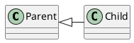

# ここにいろいろ書く

```java
public static void main(String[] args) {
  System.out.println("hello world !");
}
```

```java
interface Hoge<T extends Fuga> extends Piyo<T> {
  T get(String id) throws BeroberoException;
}
```

日本語がただしく表示されることを祈る

クラス図を以下に示す。

## どうよ？

### あいうえお
脚注[^1]とか書けるよね

#### かきくけこ

[^1]: 脚注はね、`footnote`拡張を使うといいのよ